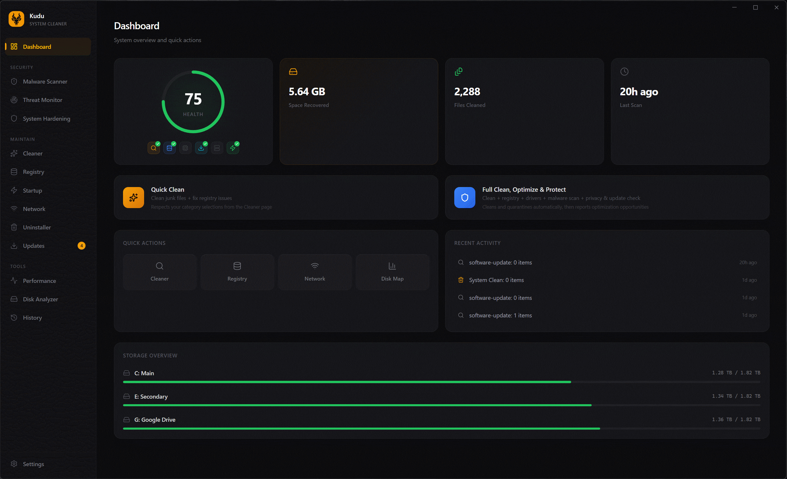

  

<h1 align="center">Kudu</h1>

  <b>Free, open-source system cleaner & security scanner for Windows, macOS, and Linux.</b> 
  Reclaim disk space. Remove malware. Take back your privacy. All in one app.

  
  
  
  
  
  

  <a href="https://github.com/adventdevinc/kudu/releases"><b>Download</b></a> &nbsp;&middot;&nbsp;
  <a href="https://usekudu.com"><b>Website</b></a> &nbsp;&middot;&nbsp;
  <a href="CLI.md"><b>CLI Docs</b></a>

---

  

## Download

Get the latest installer for your platform from [GitHub Releases](https://github.com/adventdevinc/kudu/releases):

| Platform | Format |
|----------|--------|
| Windows | `.exe` installer |
| macOS | `.dmg` (Intel & Apple Silicon) |
| Linux | `.AppImage` or `.deb` |

## Why Kudu?

Most system cleaners are closed-source, ad-filled, and want your money. Some are barely disguised malware themselves.

Kudu is **100% free, open-source, and transparent**. No ads, no upsells, no telemetry. You can read every line of code, audit every scan, and verify every delete. Built by developers who were tired of recommending CCleaner with a straight face.

## What It Does

<table>
<tr>
<td width="33%" valign="top">

### Cleaning & Optimization
- **System Cleaner** — temp files, logs, caches, crash dumps
- **Browser Cleaner** — caches across all major browsers
- **App Cleaner** — leftover app data
- **Gaming Cleaner** — game launcher & shader caches
- **Registry Cleaner** — broken/orphaned entries
- **Startup Manager** — boot impact analysis
- **Network Cleanup** — DNS, Wi-Fi profiles, ARP cache
- **Disk Analyzer** — interactive treemap of disk usage
- **Debloater** — remove Windows bloatware
- **Driver Manager** — stale driver cleanup
- **Program Uninstaller** — uninstall + leftover cleanup
- **Service Manager** — optimize Windows services
- **Software Updater** — bulk-update via winget

</td>
<td width="33%" valign="top">

### Security & Privacy
- **Malware Scanner** — signature matching, heuristic analysis, Defender integration
- **Privacy Shield** — control 30+ Windows privacy settings (telemetry, ad ID, Cortana, tracking)
- **Secure Delete** — overwrite files with random data before deletion

</td>
<td width="33%" valign="top">

### Monitoring & Tools
- **Performance Monitor** — real-time CPU, memory, disk, network, per-core stats, S.M.A.R.T.
- **System Restore Points** — create restore points before cleaning
- **Cleaning History** — track past sessions & space recovered
- **Scheduled Scans** — daily, weekly, or monthly
- **One-Click Clean** — scan & clean everything in one click
- **[CLI Mode](CLI.md)** — scriptable, no GUI required

</td>
</tr>
</table>

## Disclaimer

Kudu is intended for **advanced users** who understand system maintenance. You are responsible for reviewing items before removal. We accept no liability for data loss or system instability. Create backups before cleaning — especially for registry and debloat operations. This software is provided **"as is"** without warranty.

## Contributing

Contributions are welcome! Feel free to open issues, submit PRs, or suggest features.

If you find Kudu useful, consider giving it a star — it helps others discover the project.

## License

[MIT](LICENSE)
